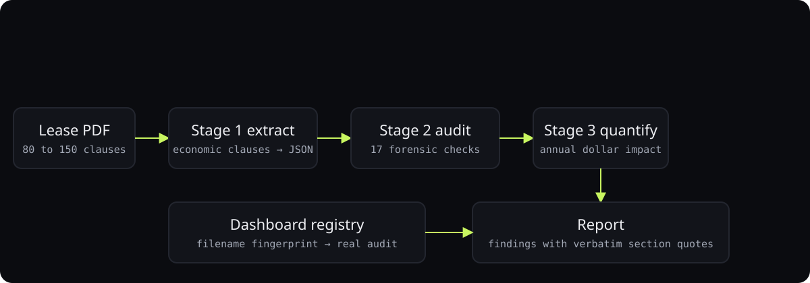

<div align="center">

# LeaseIQ

**A three-stage forensic audit that reads an NNN retail lease and finds the dollars the tenant should not be paying.**

<p>
<a href="https://ibiraheel.com/p/leaseiq"></a>
</p>

<p>


</p>

</div>

<br>

> **$15,538 a year in overcharges found across two real retail leases**  
> for retail tenants and the brokers who represent them

## What it did

Seventeen findings across two executed NNN retail leases, each quoting the lease section and the reconciliation line verbatim. Seventeen forensic checks run against industry practice, and the dashboard renders a report a CFO can act on. The leases and their audits are private; this repo runs on a fictional sample.

<sub>Outcome: measured.</sub>

## How it works

<p align="center"></p>

1. Three prompt stages, extract then audit then quantify, each producing JSON the next stage consumes.
2. Every finding must cite a lease section and a verbatim quote; the registry comments forbid fabricated figures.
3. The dashboard fingerprints the dropped filename and loads the matching audit, so demos never need a live model call.
4. Editorial React UI with a pipeline progress view sized to the lease's page count.

## Run it locally

```bash
cd dashboard
npm install
npm run dev   # http://localhost:5173
```

Drop any file with **sample** in its name to load the bundled audit.

> [!IMPORTANT]
> This repo ships one **fictional** sample audit (`dashboard/src/data/audit-sample.js`).
> Real audits are built from real leases, quote them verbatim, and are kept out of source control.

## Repository layout

```
├── dashboard/
│   ├── src/
│   ├── index.html
│   ├── package.json
│   ├── postcss.config.js
│   ├── screenshot.cjs
│   ├── tailwind.config.js
│   └── vite.config.js
└── demo-plan.md
```

---

<div align="center">

<sub>Built by <a href="https://github.com/ibi-raheel">Muhammad Ibrahim Raheel</a> · more work at <a href="https://ibiraheel.com">ibiraheel.com</a></sub>

</div>
